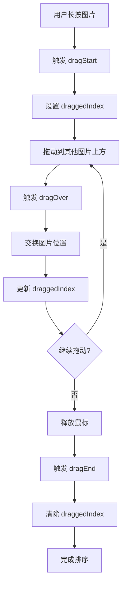

# 图片拖拽排序功能设计方案

## 需求描述

用户上传多张参考图片后，可以通过长按拖动的方式调整图片顺序，图片顺序会影响 API 调用时传递给 Gemini 的顺序。

## 技术方案

### 方案选择

采用 **HTML5 Drag and Drop API** 实现，原因：
- ✅ 无需额外依赖，保持项目轻量
- ✅ 浏览器原生支持，性能好
- ✅ 实现简单，代码量少
- ⚠️ 移动端支持需要额外处理（可后续优化）

### 实现步骤

#### 1. 添加拖拽状态

在 [`App.tsx`](image-gen-app/src/App.tsx) 中添加状态：

```typescript
const [draggedIndex, setDraggedIndex] = useState<number | null>(null)
```

#### 2. 实现拖拽处理函数

```typescript
// 开始拖拽
function handleDragStart(index: number) {
  setDraggedIndex(index)
}

// 拖拽经过
function handleDragOver(e: React.DragEvent, index: number) {
  e.preventDefault()
  
  if (draggedIndex === null || draggedIndex === index) return
  
  // 交换位置
  const newImages = [...inputImages]
  const draggedItem = newImages[draggedIndex]
  newImages.splice(draggedIndex, 1)
  newImages.splice(index, 0, draggedItem)
  
  setInputImages(newImages)
  setDraggedIndex(index)
}

// 结束拖拽
function handleDragEnd() {
  setDraggedIndex(null)
}
```

#### 3. 修改图片项渲染

在 [`App.tsx`](image-gen-app/src/App.tsx:267-280) 的图片项中添加拖拽属性：

```tsx
<div 
  key={index} 
  className={`imageItem ${draggedIndex === index ? 'dragging' : ''}`}
  draggable
  onDragStart={() => handleDragStart(index)}
  onDragOver={(e) => handleDragOver(e, index)}
  onDragEnd={handleDragEnd}
>
  
  <div className="fileName">{img.fileName}</div>
  <button onClick={() => {
    setInputImages(prev => prev.filter((_, i) => i !== index))
    if (inputImages.length === 1 && fileInputRef.current) {
      fileInputRef.current.value = ''
    }
  }} className="removeBtn">✕</button>
</div>
```

#### 4. 添加 CSS 样式

在 [`styles.css`](image-gen-app/src/styles.css) 中添加拖拽样式：

```css
.imageItem {
  cursor: grab;
  transition: opacity 0.2s, transform 0.2s;
}

.imageItem:active {
  cursor: grabbing;
}

.imageItem.dragging {
  opacity: 0.5;
  transform: scale(0.95);
}

.imageItem:hover {
  transform: scale(1.02);
}
```

## 交互流程



## 视觉反馈

1. **拖拽前**：鼠标悬停时图片轻微放大（scale 1.02）
2. **拖拽中**：被拖拽的图片半透明（opacity 0.5）+ 缩小（scale 0.95）
3. **拖拽后**：恢复正常状态

## 优化建议

### 短期优化
- ✅ 添加拖拽手柄图标（可选）
- ✅ 添加拖拽时的边框高亮

### 长期优化
- 🔄 添加移动端触摸支持（使用 touch events）
- 🔄 添加拖拽动画过渡效果
- 🔄 添加拖拽预览（ghost image）

## 代码修改清单

### 文件：[`App.tsx`](image-gen-app/src/App.tsx)

**修改位置 1**：添加状态（第 77 行后）
```typescript
const [draggedIndex, setDraggedIndex] = useState<number | null>(null)
```

**修改位置 2**：添加处理函数（第 173 行后）
```typescript
function handleDragStart(index: number) {
  setDraggedIndex(index)
}

function handleDragOver(e: React.DragEvent, index: number) {
  e.preventDefault()
  if (draggedIndex === null || draggedIndex === index) return
  
  const newImages = [...inputImages]
  const draggedItem = newImages[draggedIndex]
  newImages.splice(draggedIndex, 1)
  newImages.splice(index, 0, draggedItem)
  
  setInputImages(newImages)
  setDraggedIndex(index)
}

function handleDragEnd() {
  setDraggedIndex(null)
}
```

**修改位置 3**：修改图片项（第 269 行）
```tsx
<div 
  key={index} 
  className={`imageItem ${draggedIndex === index ? 'dragging' : ''}`}
  draggable
  onDragStart={() => handleDragStart(index)}
  onDragOver={(e) => handleDragOver(e, index)}
  onDragEnd={handleDragEnd}
>
```

### 文件：[`styles.css`](image-gen-app/src/styles.css)

**修改位置**：在 `.imageItem` 样式中添加（第 522 行后）
```css
.imageItem {
  position: relative;
  aspect-ratio: 1;
  border-radius: 8px;
  overflow: hidden;
  border: 1px solid var(--border);
  cursor: grab;
  transition: opacity 0.2s, transform 0.2s;
}

.imageItem:active {
  cursor: grabbing;
}

.imageItem.dragging {
  opacity: 0.5;
  transform: scale(0.95);
}

.imageItem:hover {
  transform: scale(1.02);
}
```

## 测试要点

1. ✅ 拖拽单张图片到不同位置
2. ✅ 拖拽多张图片验证顺序正确
3. ✅ 拖拽后生成图片，验证 API 调用顺序正确
4. ✅ 删除图片后拖拽功能正常
5. ✅ 视觉反馈流畅自然

## 实现优先级

**P0（必须）**：
- [x] 基础拖拽排序功能
- [x] 视觉反馈（透明度、缩放）
- [x] 拖拽状态管理

**P1（建议）**：
- [ ] 移动端触摸支持
- [ ] 拖拽动画优化

**P2（可选）**：
- [ ] 拖拽手柄
- [ ] 自定义拖拽预览
