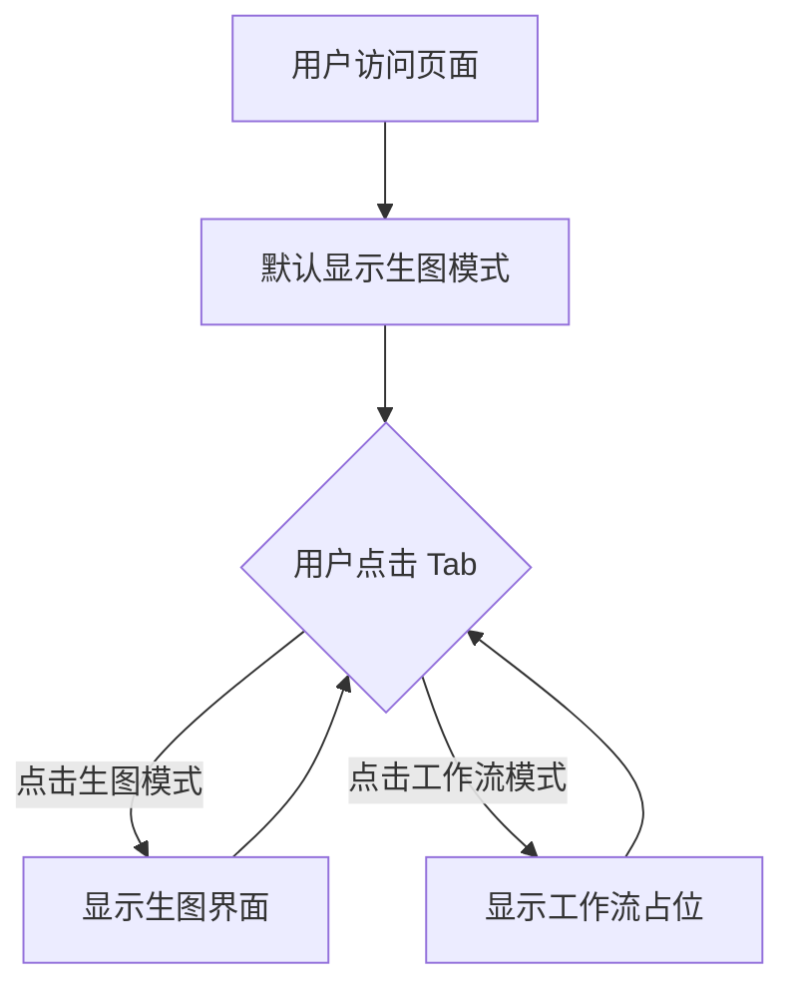

# 模式切换功能设计方案

## 需求描述

在页面顶部添加 Tab 切换功能，支持两种模式：
- **生图模式**：当前已实现的功能
- **工作流模式**：待规划的功能（暂时显示占位内容）

## 设计方案

### UI 布局

```
┌─────────────────────────────────────────────┐
│  Logo  [生图模式] [工作流模式]      ⚙️ 设置  │
├─────────────────────────────────────────────┤
│                                             │
│  当前模式的内容区域                          │
│                                             │
└─────────────────────────────────────────────┘
```

### 实现步骤

#### 1. 添加模式状态

```typescript
type AppMode = 'generate' | 'workflow'
const [mode, setMode] = useState<AppMode>('generate')
```

#### 2. 创建 Tab 组件

在顶部栏中添加 Tab 切换按钮：

```tsx
<div className="modeTabs">
  <button 
    className={`modeTab ${mode === 'generate' ? 'active' : ''}`}
    onClick={() => setMode('generate')}
  >
    🎨 生图模式
  </button>
  <button 
    className={`modeTab ${mode === 'workflow' ? 'active' : ''}`}
    onClick={() => setMode('workflow')}
  >
    🔄 工作流模式
  </button>
</div>
```

#### 3. 条件渲染内容

```tsx
<div className="mainContent">
  {mode === 'generate' ? (
    // 当前的生图模式内容
    <>
      <section className="leftPanel">...</section>
      <section className="rightPanel">...</section>
    </>
  ) : (
    // 工作流模式占位内容
    <div className="workflowPlaceholder">
      <div className="placeholderContent">
        <h2>🔄 工作流模式</h2>
        <p>功能开发中，敬请期待...</p>
      </div>
    </div>
  )}
</div>
```

### CSS 样式

```css
/* Tab 容器 */
.modeTabs {
  display: flex;
  gap: 8px;
  align-items: center;
}

/* Tab 按钮 */
.modeTab {
  padding: 8px 16px;
  border-radius: 8px;
  border: 1px solid var(--border);
  background: rgba(255, 255, 255, 0.04);
  color: var(--muted);
  cursor: pointer;
  transition: all 0.2s;
  font-size: 14px;
}

.modeTab:hover {
  background: rgba(255, 255, 255, 0.08);
}

.modeTab.active {
  border-color: rgba(124, 58, 237, 0.6);
  background: rgba(124, 58, 237, 0.15);
  color: var(--text);
}

/* 工作流占位 */
.workflowPlaceholder {
  display: flex;
  align-items: center;
  justify-content: center;
  min-height: 400px;
  background: var(--panel);
  border: 1px solid var(--border);
  border-radius: 14px;
  padding: 40px;
}

.placeholderContent {
  text-align: center;
  color: var(--muted);
}

.placeholderContent h2 {
  font-size: 24px;
  margin-bottom: 12px;
  color: var(--text);
}

.placeholderContent p {
  font-size: 14px;
}
```

## 代码修改清单

### 文件：[`App.tsx`](image-gen-app/src/App.tsx)

**位置 1**：添加类型和状态（第 56 行后）
```typescript
type AppMode = 'generate' | 'workflow'

export default function App() {
  const initial = useMemo(() => readInitialConfig(), [])
  const fileInputRef = useRef<HTMLInputElement>(null)
  
  const [mode, setMode] = useState<AppMode>('generate')
```

**位置 2**：修改顶部栏（第 177-186 行）
```tsx
<div className="topBar">
  <div className="topBarLeft">
    <h1 style={{display: 'flex', alignItems: 'center', margin: 0}}>
      
      零界设计
    </h1>
    <div className="modeTabs">
      <button 
        className={`modeTab ${mode === 'generate' ? 'active' : ''}`}
        onClick={() => setMode('generate')}
      >
        🎨 生图模式
      </button>
      <button 
        className={`modeTab ${mode === 'workflow' ? 'active' : ''}`}
        onClick={() => setMode('workflow')}
      >
        🔄 工作流模式
      </button>
    </div>
  </div>
  <div className="topBarRight">
    <button className="settingsBtn" onClick={() => setShowSettings(true)}>
      ⚙️ 设置
    </button>
  </div>
</div>
```

**位置 3**：修改主内容区（第 244 行）
```tsx
<div className="mainContent">
  {mode === 'generate' ? (
    <>
      <section className="leftPanel">
        {/* 现有的生图模式内容 */}
      </section>
      <section className="rightPanel">
        {/* 现有的预览内容 */}
      </section>
    </>
  ) : (
    <div className="workflowPlaceholder">
      <div className="placeholderContent">
        <h2>🔄 工作流模式</h2>
        <p>功能开发中，敬请期待...</p>
      </div>
    </div>
  )}
</div>
```

### 文件：[`styles.css`](image-gen-app/src/styles.css)

**位置 1**：修改 topBarLeft 样式（第 50 行）
```css
.topBarLeft {
  display: flex;
  align-items: center;
  gap: 24px;
}

.topBarLeft h1 {
  font-size: 24px;
  margin: 0;
  letter-spacing: 0.2px;
}
```

**位置 2**：添加 Tab 样式（第 77 行后）
```css
.modeTabs {
  display: flex;
  gap: 8px;
  align-items: center;
}

.modeTab {
  padding: 8px 16px;
  border-radius: 8px;
  border: 1px solid var(--border);
  background: rgba(255, 255, 255, 0.04);
  color: var(--muted);
  cursor: pointer;
  transition: all 0.2s;
  font-size: 14px;
}

.modeTab:hover {
  background: rgba(255, 255, 255, 0.08);
}

.modeTab.active {
  border-color: rgba(124, 58, 237, 0.6);
  background: rgba(124, 58, 237, 0.15);
  color: var(--text);
}

.workflowPlaceholder {
  display: flex;
  align-items: center;
  justify-content: center;
  min-height: 400px;
  background: var(--panel);
  border: 1px solid var(--border);
  border-radius: 14px;
  padding: 40px;
}

.placeholderContent {
  text-align: center;
  color: var(--muted);
}

.placeholderContent h2 {
  font-size: 24px;
  margin-bottom: 12px;
  color: var(--text);
}

.placeholderContent p {
  font-size: 14px;
}
```

## 交互流程



## 扩展性

当工作流模式功能开发完成后，只需：
1. 创建工作流组件
2. 替换占位内容为实际组件
3. 无需修改 Tab 切换逻辑

## 优势

✅ **简洁实现**：最小化代码改动  
✅ **清晰分离**：两种模式完全独立  
✅ **易于扩展**：预留工作流模式接口  
✅ **用户友好**：直观的 Tab 切换体验
